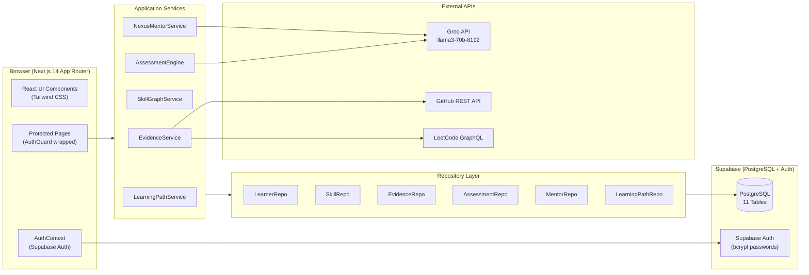
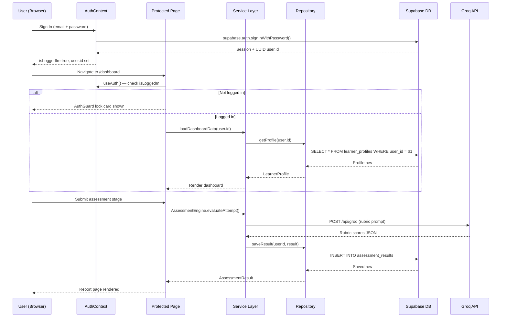
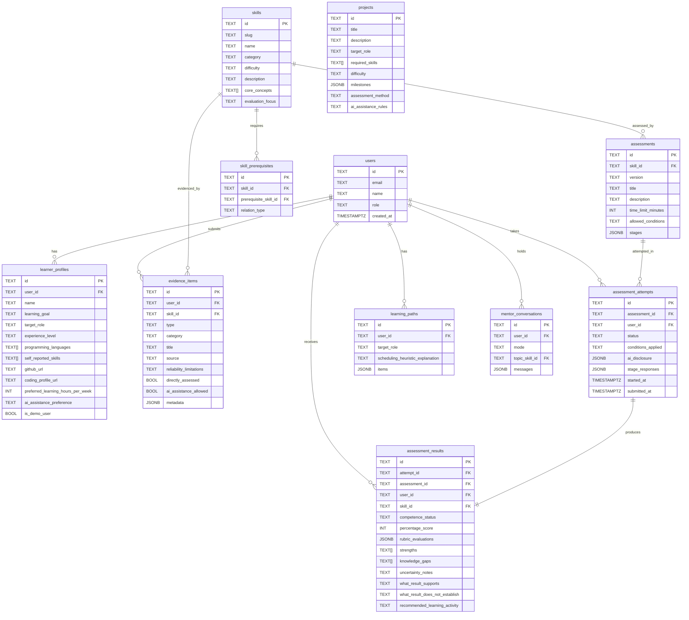

# Software Requirements Specification (SRS)
## ProofPath AI — Evidence-Based Competence Assessment Platform

| Field | Value |
|-------|-------|
| **Document Version** | 1.0.0 |
| **Date** | 25 September 2026 |
| **Status** | Released |
| **Author** | Immanuel Thomas J |
| **Platform** | ProofPath AI (formerly Solvix) |
| **Supabase Project** | `ohmqnuoxtjuhxbqighyq.supabase.co` |
| **Repository** | `d:/Downloads/Solvix` |
| **Tech Stack** | Next.js 14 App Router · Supabase · Groq LLM · TypeScript · Tailwind CSS |

---

## Table of Contents

1. [Introduction](#1-introduction)
2. [Scope](#2-scope)
3. [Definitions, Acronyms & Abbreviations](#3-definitions-acronyms--abbreviations)
4. [System Overview & Architecture](#4-system-overview--architecture)
5. [User Roles & Personas](#5-user-roles--personas)
6. [Functional Requirements](#6-functional-requirements)
   - 6.1 Authentication & Authorization
   - 6.2 Dashboard
   - 6.3 Profile & Claims
   - 6.4 Evidence Vault
   - 6.5 Skill Graph & DAG
   - 6.6 Competence Assessments
   - 6.7 Learning Path
   - 6.8 Nexus Socratic Mentor
   - 6.9 PDF Report Generation
7. [Non-Functional Requirements](#7-non-functional-requirements)
8. [Database Schema](#8-database-schema)
9. [External Integrations](#9-external-integrations)
10. [UI/UX Requirements](#10-uiux-requirements)
11. [Security Requirements](#11-security-requirements)
12. [Constraints & Assumptions](#12-constraints--assumptions)
13. [Appendix — File Structure](#13-appendix--file-structure)

---

## 1. Introduction

### 1.1 Purpose
This Software Requirements Specification (SRS) describes the complete functional, non-functional, and architectural requirements for **ProofPath AI** — an evidence-based adaptive learning and competence assessment platform. The document is intended for developers, designers, and stakeholders responsible for building, maintaining, and extending the platform.

### 1.2 Product Vision
> "Don't ask learners what they think they know. Check what they can prove."

ProofPath AI replaces resume-based and self-reported skill claims with a **cryptographically auditable, multi-tier evidence verification pipeline**. Candidates submit real artifacts (GitHub repos, coding profiles, explanations), complete structured assessments with rubric-based evaluation, and receive honest AI-driven analysis of their competence gaps — all without fabricated scores or mock data.

### 1.3 Problem Statement
The current hiring and learning landscape suffers from:
- Inflated self-reported skill claims on resumes
- Credential-based filtering that ignores actual demonstrated ability
- AI-generated answers masking true competency gaps
- No persistent, auditable record of what a candidate can *actually do*

### 1.4 Intended Audience
- **Learners / Candidates** — individuals seeking to verify and develop engineering competencies
- **Evaluators** — technical interviewers or assessors reviewing verified evidence
- **Platform Administrators** — managing the skill catalog and assessment bank

---

## 2. Scope

### 2.1 In Scope
| Module | Description |
|--------|-------------|
| Authentication | Supabase Auth sign-up/sign-in, UUID-based user isolation |
| Dashboard | Real-time summary of evidence tiers, skill telemetry, quick actions |
| Profile & Claims | Learner self-reported skills, target role, onboarding |
| Evidence Vault | Multi-type evidence collection, tier classification (CLAIMED → PROVEN) |
| Skill Graph & DAG | Directed Acyclic Graph of skill prerequisites, DFS cycle detection |
| Assessments | Multi-stage structured assessment with rubric-based LLM evaluation |
| Learning Path | Personalized sequenced study plan generated from skill gaps |
| Nexus Mentor | Groq-powered Socratic AI tutor with per-skill conversation history |
| PDF Reports | Downloadable assessment report with score, rubric, strengths, gaps |

### 2.2 Out of Scope
- Payment / subscription management
- Video proctoring / biometric authentication
- Peer review or evaluator-to-candidate messaging
- Mobile native app (iOS/Android)
- Third-party LMS integrations (e.g., Canvas, Moodle)

---

## 3. Definitions, Acronyms & Abbreviations

| Term | Definition |
|------|-----------|
| **DAG** | Directed Acyclic Graph — the prerequisite dependency graph of skills |
| **DFS** | Depth-First Search — used for cycle detection in the skill DAG |
| **Evidence Tier** | Classification level: CLAIMED < INFERRED < VERIFIED < PROVEN |
| **Rubric Evaluation** | Structured multi-criterion scoring of assessment stage responses |
| **Competence Status** | Outcome of assessment: NOT_ASSESSED → DEMONSTRATED_IN_ASSESSED_CONTEXT |
| **RLS** | Row Level Security — Supabase PostgreSQL table access policy |
| **LLM** | Large Language Model (Groq API, model: `llama3-70b-8192`) |
| **Socratic Mentor** | AI tutor that asks guiding questions instead of giving direct answers |
| **Attempt** | A single candidate sitting of an assessment |
| **AuthGuard** | React component that locks a page for unauthenticated visitors |
| **SRS** | Software Requirements Specification (this document) |

---

## 4. System Overview & Architecture

### 4.1 High-Level Architecture



### 4.2 Technology Stack

| Layer | Technology |
|-------|-----------|
| **Frontend** | Next.js 14 (App Router), React 18, TypeScript 5 |
| **Styling** | Tailwind CSS 3, Lucide React icons |
| **Backend / DB** | Supabase (PostgreSQL 15, GoTrue Auth) |
| **AI / LLM** | Groq API — `llama3-70b-8192` |
| **PDF Generation** | jsPDF (dynamic import, SSR-safe) |
| **Testing** | Vitest 15 tests, 7 test files |
| **Build** | Next.js production build (`npm run build`) |
| **Hosting** | `npm start` → `http://localhost:3000` |

### 4.3 Data Flow



### 4.4 Repository Pattern

All data access goes through 6 typed repository singletons exported from [`supabaseStore.ts`](file:///d:/Downloads/Solvix/src/repositories/supabase/supabaseStore.ts):

| Singleton | Table(s) | User-Scoped? |
|-----------|----------|-------------|
| `learnerRepo` | `learner_profiles`, `users` | ✅ Yes |
| `skillRepo` | `skills`, `skill_prerequisites` | ❌ Global catalog |
| `evidenceRepo` | `evidence_items` | ✅ Yes |
| `assessmentRepo` | `assessments`, `assessment_attempts`, `assessment_results` | Attempts/Results: ✅ |
| `learningPathRepo` | `learning_paths`, `projects` | `learning_paths`: ✅ |
| `mentorRepo` | `mentor_conversations` | ✅ Yes |

---

## 5. User Roles & Personas

### 5.1 Roles

| Role | DB Value | Capabilities |
|------|----------|-------------|
| **Learner** | `learner` | Full self-service: profile, evidence, assessments, mentor, path |
| **Evaluator** | `evaluator` | Future: review candidate evidence bundles (not yet implemented) |
| **Admin** | `admin` | Future: manage skill catalog, assessment bank (not yet implemented) |

### 5.2 Primary Persona — Learner
- **Name:** Engineering candidate
- **Goal:** Prove technical competence to themselves and future employers
- **Pain Points:** Rejected for roles despite real skills; no way to show *how* they know something
- **Usage Pattern:** Claims skills → submits evidence → takes assessments → reviews gaps → follows learning path

### 5.3 Access Rules

| Page | Unauthenticated | Authenticated |
|------|----------------|--------------|
| `/` (landing) | ✅ Full access | ✅ Full access |
| `/transparency` | ✅ Full access | ✅ Full access |
| `/login` | ✅ Visible | Redirect to /dashboard |
| `/dashboard` | 🔒 AuthGuard lock | ✅ Full access |
| `/onboarding` | 🔒 AuthGuard lock | ✅ Full access |
| `/evidence` | 🔒 AuthGuard lock | ✅ Full access |
| `/evidence/analyze` | 🔒 AuthGuard lock | ✅ Full access |
| `/skills` | 🔒 AuthGuard lock | ✅ Full access |
| `/assessment` | 🔒 AuthGuard lock | ✅ Full access |
| `/assessment/[id]` | 🔒 AuthGuard lock | ✅ Full access |
| `/assessment/report/[id]` | 🔒 AuthGuard lock | ✅ Full access |
| `/path` | 🔒 AuthGuard lock | ✅ Full access |
| `/mentor` | 🔒 AuthGuard lock | ✅ Full access |

---

## 6. Functional Requirements

### 6.1 Authentication & Authorization

#### FR-AUTH-01: Sign Up
- System shall allow any visitor to create an account via `/login` page
- Required fields: Full Name, Email, Password (min 8 chars)
- On success: Supabase `auth.users` row created with UUID `id`; `public.users` row inserted; redirect to `/onboarding`
- On failure: Display field-level validation errors

#### FR-AUTH-02: Sign In
- System shall authenticate users via email + password
- Uses `supabase.auth.signInWithPassword()`
- On success: `AuthContext` sets `user` (UUID) and `profile`; sidebar shows user name + logout button
- Session persists via Supabase cookie until explicit logout

#### FR-AUTH-03: Sign Out
- Clicking "Sign out" in sidebar calls `supabase.auth.signOut()`
- Clears `AuthContext` state; sidebar reverts to Sign In button
- User redirected to `/` (landing page)

#### FR-AUTH-04: Auth Guard
- All protected routes wrapped in `<AuthGuard>` component
- Unauthenticated visitors see a lock card with "Sign In" / "Create Account" buttons
- No protected data is fetched or rendered for unauthenticated visitors
- Zero cross-user data leakage: every query uses `user.id` from Supabase UUID

#### FR-AUTH-05: Session Persistence
- `AuthContext` calls `supabase.auth.getSession()` on mount
- `onAuthStateChange` listener updates state on login/logout events
- Loading state (`isLoading`) shown in sidebar while session is being resolved

---

### 6.2 Dashboard

**Route:** `/dashboard`
**File:** [`src/app/dashboard/page.tsx`](file:///d:/Downloads/Solvix/src/app/dashboard/page.tsx)

#### FR-DASH-01: Evidence Tier Metrics
System shall display 4 real-time metric cards loaded from Supabase:
- **CLAIMED** — count of CLAIMED category evidence items for the signed-in user
- **INFERRED** — count of INFERRED category evidence items
- **VERIFIED** — count of VERIFIED category evidence items
- **PROVEN** — count of PROVEN category evidence items

#### FR-DASH-02: Skill Telemetry Matrix
- Lists all skills from `public.skills` joined with user's evidence for each skill
- Displays confidence level, evidence count, and top evidence category per skill
- All data scoped to `user.id` — no other user's data shown

#### FR-DASH-03: Quick Actions
- Links to: Evidence Vault, Skill Graph, Active Assessments, Learning Path

#### FR-DASH-04: Recent Assessment Results
- Lists the 3 most recent `assessment_results` rows for the signed-in user
- Shows: skill name, percentage score, competence status, date

#### FR-DASH-05: No Profile State
- If user has no profile yet, shows a concise prompt card with a link to `/onboarding`

---

### 6.3 Profile & Claims

**Route:** `/onboarding`
**File:** [`src/app/onboarding/page.tsx`](file:///d:/Downloads/Solvix/src/app/onboarding/page.tsx)

#### FR-PROF-01: Profile Creation
- New users complete a form with: Full Name, Learning Goal, Target Role, Experience Level, Programming Languages (multi-select), Self-Reported Skills (free-form tags), GitHub URL, LeetCode/Coding Profile URL, Weekly Learning Hours, AI Assistance Preference
- On submit: inserts row into `learner_profiles` with `user_id = auth.user.id`

#### FR-PROF-02: Profile Editing
- Existing users see their current profile pre-filled in the form
- Editing and submitting updates the existing `learner_profiles` row

#### FR-PROF-03: No Pre-filled Mock Data
- Form shows empty fields for new users — no demo or hardcoded data
- Profile data is strictly from Supabase for the signed-in user's UUID

#### FR-PROF-04: Self-Reported Skills
- Candidates list skills they believe they have
- These are stored as `TEXT[]` in `learner_profiles.self_reported_skills`
- These feed into the evidence discrepancy analysis on Dashboard and Skills pages

---

### 6.4 Evidence Vault

**Route:** `/evidence`
**File:** [`src/app/evidence/page.tsx`](file:///d:/Downloads/Solvix/src/app/evidence/page.tsx)

#### FR-EV-01: Evidence Types
System recognizes 9 evidence types stored in `evidence_items.type`:
1. `SELF_REPORTED` — Candidate's own description
2. `RESUME_CLAIM` — From uploaded resume text
3. `GITHUB_REPOSITORY` — Real GitHub repo analyzed via API
4. `CODING_PLATFORM_PROFILE` — LeetCode/HackerRank profile data
5. `PROJECT_DESCRIPTION` — Free-form project description
6. `EXPLANATION_RESPONSE` — Written explanation of a concept
7. `ASSESSMENT_RESULT` — Output of a ProofPath assessment
8. `CONTROLLED_MODIFICATION_TASK` — Code debugging under controlled conditions
9. `TRANSFER_TASK_RESULT` — Novel problem-solving evidence

#### FR-EV-02: Evidence Categories (Tiers)
| Tier | Meaning |
|------|---------|
| `CLAIMED` | Self-reported; no external verification |
| `INFERRED` | Indirect signals (GitHub activity, public profiles) |
| `VERIFIED` | Structured assessment or controlled task result |
| `PROVEN` | Reproducible, multi-session demonstration |

#### FR-EV-03: Manual Evidence Entry
- Modal form to add evidence manually
- Required: skill (dropdown from Supabase skills catalog), title, type, source URL/description, reliability limitations, AI assistance flag
- On submit: inserts into `evidence_items` with `user_id = auth.user.id`

#### FR-EV-04: Evidence List & Filtering
- Lists all evidence items for the signed-in user
- Filter tabs: All, CLAIMED, INFERRED, VERIFIED, PROVEN
- Each card shows: tier badge, type, skill name, source, date, reliability limitations

#### FR-EV-05: Evidence Analyzer (Repo Analysis)
**Sub-route:** `/evidence/analyze`
- Input: GitHub repository URL or LeetCode username
- System calls real GitHub REST API and LeetCode GraphQL API
- Returns: inferred skill signals, language distribution, commit volume
- "Import to Vault" button saves the analysis as evidence items in Supabase

#### FR-EV-06: Real-Time Skill-Evidence Discrepancy
- `EvidenceService.analyzeSkills()` computes confidence for each skill
- Discrepancy flagged when: self-reported skill exists in `learner_profiles.self_reported_skills` but no `VERIFIED` or `PROVEN` evidence exists for that skill

---

### 6.5 Skill Graph & DAG

**Route:** `/skills`
**File:** [`src/app/skills/page.tsx`](file:///d:/Downloads/Solvix/src/app/skills/page.tsx)

#### FR-SKILL-01: Skill Catalog
- All skills loaded from `public.skills` (global — not user-scoped)
- Each skill has: name, category, difficulty, description, core_concepts array, evaluation_focus

#### FR-SKILL-02: Prerequisite DAG
- Prerequisite edges loaded from `public.skill_prerequisites`
- Displayed as a visual DAG with flow from prerequisite → dependent skill
- Columns organized by topological tier (prerequisite depth)

#### FR-SKILL-03: Cycle Validation
- `SkillGraphService.validateGraph()` runs 3-color DFS (WHITE/GRAY/BLACK)
- If any cycle is detected, system shows a warning banner with affected nodes
- Result: "DAG Validated • 0 Cycles" when clean

#### FR-SKILL-04: Topological Ordering
- `SkillGraphService.getTopologicalSort()` produces a valid study sequence
- Displayed as Topological List alongside the visual DAG

#### FR-SKILL-05: Skill Detail Panel
- Clicking a skill node shows: description, core concepts list, evaluation focus, prerequisite relationships, user's evidence for that skill, available assessments

#### FR-SKILL-06: Claim Status Overlay
- Each skill node shows the user's highest evidence category for that skill (CLAIMED / INFERRED / VERIFIED / PROVEN or unstarted)

---

### 6.6 Competence Assessments

**Routes:** `/assessment`, `/assessment/[id]`, `/assessment/report/[attemptId]`

#### FR-ASSESS-01: Assessment Catalog
- Lists all assessments from `public.assessments`
- Each assessment linked to a specific skill via `skill_id`
- Shows: title, skill name, version, time limit, allowed AI conditions

#### FR-ASSESS-02: Multi-Stage Assessment Structure
Each assessment contains JSONB `stages` array. Each stage has a `type`:
| Stage Type | Description |
|-----------|-------------|
| `EXPLANATION` | Written conceptual explanation with rubric |
| `MODIFICATION` | Bug fix or code modification task with starter code |
| `TRANSFER` | Novel problem requiring knowledge transfer |
| `DEBATE` | Trade-off justification / architectural reasoning |

#### FR-ASSESS-03: Stage Navigation
- Candidates answer one stage at a time
- Can navigate between stages freely before submission
- Each stage has a text area for written responses and a code editor for code tasks

#### FR-ASSESS-04: AI Disclosure
- Before starting: candidate must confirm AI assistance conditions (`AI_ALLOWED`, `AI_RESTRICTED`, `AI_DISCLOSURE_REQUIRED`, `PRACTICE_MODE`)
- AI disclosure stored in `assessment_attempts.ai_disclosure` JSONB

#### FR-ASSESS-05: Submission & Evaluation
- On final submit: `AssessmentEngine.evaluateAttempt()` called
- Groq API (`llama3-70b-8192`) evaluates each stage against rubric criteria
- Rubric scores aggregated into `percentage_score`
- `competence_status` determined by score thresholds:
  | Score | Competence Status |
  |-------|------------------|
  | 0–39% | `INITIAL_EVIDENCE` |
  | 40–59% | `PARTIALLY_DEMONSTRATED` |
  | 60–89% | `DEMONSTRATED_IN_ASSESSED_CONTEXT` |
  | 90–100% | `DEMONSTRATED_IN_ASSESSED_CONTEXT` (recommend transfer validation) |

#### FR-ASSESS-06: Result Persistence
- `assessment_results` row inserted with: rubric_evaluations, strengths, knowledge_gaps, what_result_supports, what_result_does_not_establish, recommended_learning_activity
- `assessment_attempts.status` updated to `EVALUATED`
- Evidence item (`ASSESSMENT_RESULT` type) automatically added to Evidence Vault

#### FR-ASSESS-07: Report Page
- Shows full rubric breakdown per stage, score visualization, strengths, knowledge gaps
- Copyable JSON audit payload (includes SHA-256 style record hash)
- **Download PDF Report** button (see §6.9)

---

### 6.7 Learning Path

**Route:** `/path`
**File:** [`src/app/path/page.tsx`](file:///d:/Downloads/Solvix/src/app/path/page.tsx)

#### FR-PATH-01: Personalized Path Generation
- System queries user's evidence gaps and skill prerequisites
- Generates a sequenced study plan respecting the DAG topological order
- Path items stored in `learning_paths.items` JSONB per user

#### FR-PATH-02: Path Items
Each learning path item contains:
- Skill to study
- Recommended resources (curated)
- Estimated hours
- Prerequisite satisfaction status
- Link to available assessment for that skill

#### FR-PATH-03: Associated Projects
- Real-world projects from `public.projects` table recommended based on skill coverage
- Each project has: milestones, required skills, difficulty rating, AI assistance rules

#### FR-PATH-04: Progress Tracking
- Completed skills (with VERIFIED/PROVEN evidence) shown as completed in the path
- Path dynamically re-generates as user's evidence tier improves

---

### 6.8 Nexus Socratic Mentor

**Route:** `/mentor`
**File:** [`src/app/mentor/page.tsx`](file:///d:/Downloads/Solvix/src/app/mentor/page.tsx)

#### FR-MENTOR-01: Socratic AI Tutor
- Groq-powered (`llama3-70b-8192`) conversational mentor
- Asks guiding questions rather than giving direct answers
- User selects a skill topic from the Supabase skills catalog to focus discussion

#### FR-MENTOR-02: Conversation Modes
| Mode | Purpose |
|------|---------|
| `LEARNING` | Deep-dive understanding of a skill topic |
| `PRACTICE` | Solve problems with Socratic guidance |
| `ASSESSMENT_PREP` | Prepare for an upcoming assessment |
| `ASSESSMENT` | Conduct a conversational mini-assessment |
| `REFLECTION` | Review what was learned after an assessment |

#### FR-MENTOR-03: Conversation Persistence
- All messages stored in `mentor_conversations` JSONB column
- User can resume previous conversations for the same skill topic
- Scoped strictly to `user_id` — no cross-user conversation access

#### FR-MENTOR-04: Real-Time Streaming
- Groq API calls stream token-by-token for low-latency UX
- Each user message + AI response stored after stream completes

---

### 6.9 PDF Report Generation

**Trigger:** "Download PDF Report" button on `/assessment/report/[attemptId]`

#### FR-PDF-01: PDF Content
PDF shall include:
1. **Header** — Blue ProofPath AI branded header with generation date
2. **Skill & Assessment Info** — Skill name, assessment title, version
3. **Score** — Percentage score with color-coded visual bar (green ≥80%, amber ≥60%, red <60%)
4. **Competence Status** — Human-readable status string
5. **What This Result Supports** — Exact text from `assessment_results.what_result_supports`
6. **What This Does Not Establish** — Exact text from `what_result_does_not_establish`
7. **Demonstrated Strengths** — Up to 5 bullet points from `strengths[]`
8. **Knowledge Gaps** — Up to 5 bullet points from `knowledge_gaps[]`
9. **Recommended Next Step** — Text from `recommended_learning_activity`
10. **Footer** — "ProofPath AI — Competence Verification Protocol" + Attempt ID

#### FR-PDF-02: Technical Requirements
- Uses `jsPDF` with dynamic `import('jspdf')` (SSR-safe — no server-side execution)
- File name format: `proofpath-report-{skill-slug}-{YYYY-MM-DD}.pdf`
- Triggers browser download without page navigation

---

## 7. Non-Functional Requirements

### 7.1 Performance
- **NFR-PERF-01:** All dashboard data (profile + skills + evidence counts) must load within 3 seconds on a standard broadband connection
- **NFR-PERF-02:** Groq LLM evaluation must complete within 30 seconds per assessment submission; show loading indicator during evaluation
- **NFR-PERF-03:** PDF generation must complete within 5 seconds for any report

### 7.2 Scalability
- **NFR-SCALE-01:** System must support at least 1,000 concurrent Supabase connections
- **NFR-SCALE-02:** All database queries use indexed columns (`user_id`, `skill_id`, `attempt_id`) — no full table scans on user-scoped data

### 7.3 Reliability
- **NFR-REL-01:** All 15 Vitest tests must pass (`npx vitest run`) after any code change
- **NFR-REL-02:** `npm run build` must complete with 0 TypeScript errors and 0 warnings
- **NFR-REL-03:** Supabase connection failures must show user-friendly error messages, not stack traces

### 7.4 Usability
- **NFR-USE-01:** Left sidebar navigation visible on desktop (≥ 1024px); hamburger drawer on mobile
- **NFR-USE-02:** Active navigation item highlighted with blue indicator
- **NFR-USE-03:** All loading states show skeleton/spinner UI — no blank screen
- **NFR-USE-04:** All forms show real-time field validation before submission

### 7.5 Maintainability
- **NFR-MAINT-01:** All Supabase queries go through typed repository classes — no raw `supabase.from()` calls in page components
- **NFR-MAINT-02:** Every new route must be wrapped in `<AuthGuard>` before merging
- **NFR-MAINT-03:** Zero hardcoded user IDs or demo data in any page component

### 7.6 Accessibility
- **NFR-ACC-01:** All interactive elements have `aria-label` attributes
- **NFR-ACC-02:** Color is never the sole means of conveying information (text labels alongside color-coded badges)
- **NFR-ACC-03:** Minimum 4.5:1 contrast ratio for all body text

---

## 8. Database Schema

### 8.1 Tables Overview



### 8.2 Row Level Security
All 11 tables have RLS enabled. Current policy: `FOR ALL USING (true)` — permissive for development. All user isolation is enforced at the application layer via `.eq("user_id", userId)` filters in repository methods.

> [!IMPORTANT]
> **Production Hardening Required:** Before public deployment, RLS policies must be tightened to `USING (auth.uid()::text = user_id)` to enforce user isolation at the database layer.

### 8.3 Seeded Data (Initial State)
| Table | Rows |
|-------|------|
| `skills` | 6 rows (skill-ds-01 through skill-db-06) |
| `skill_prerequisites` | 4 edges (DAG) |
| `assessments` | 1 assessment (`assess-hash-01` for Hash Tables) |
| `projects` | 1 project (High-Throughput KV Store) |

---

## 9. External Integrations

### 9.1 Groq API
- **Endpoint:** `https://api.groq.com/openai/v1/chat/completions`
- **Model:** `llama3-70b-8192`
- **Used for:** Assessment rubric evaluation, Socratic mentor responses, evidence skill analysis
- **Auth:** `GROQ_API_KEY` environment variable
- **Next.js Route Handler:** [`src/app/api/groq/route.ts`](file:///d:/Downloads/Solvix/src/app/api/groq/route.ts)

### 9.2 GitHub REST API
- **Used for:** Repository evidence analysis in `/evidence/analyze`
- **Endpoints:** `GET /repos/{owner}/{repo}`, `GET /repos/{owner}/{repo}/languages`, `GET /repos/{owner}/{repo}/commits`
- **Auth:** Optional `GITHUB_TOKEN` env variable (higher rate limit)

### 9.3 LeetCode GraphQL API
- **Used for:** Coding platform profile evidence analysis
- **Endpoint:** `https://leetcode.com/graphql`
- **Auth:** None (public profile data only)

### 9.4 Supabase
- **Project URL:** `https://ohmqnuoxtjuhxbqighyq.supabase.co`
- **Anon Key:** Stored in `NEXT_PUBLIC_SUPABASE_ANON_KEY`
- **Auth Provider:** Supabase GoTrue (email/password with bcrypt hashing)

---

## 10. UI/UX Requirements

### 10.1 Navigation Layout

#### Left Sidebar (Desktop)
- Width: 240px (`w-60`), full viewport height, sticky, white background, right border `border-slate-200`
- **Top:** ProofPath.AI logo with blue shield icon, subtitle "Evidence & Calibration"
- **Middle (nav items):** Dashboard, Profile & Claims, Evidence, Skills, Assessments, Learning Path, Nexus Mentor, Transparency
- **Bottom:** User avatar (initial letter) + display name + "Sign out" button (when logged in), OR "Sign In" button (when logged out)
- Active item: `bg-blue-50 text-blue-700` with blue dot `●` on right

#### Mobile Sidebar
- Hidden by default (`-translate-x-full`)
- Hamburger icon (`☰`) button fixed at top-left (`fixed top-3 left-3`)
- Tapping hamburger slides in the drawer (`translate-x-0`) with backdrop overlay

### 10.2 Page Layout Shell

```
┌──────────────────────────────────────────────────────┐
│  [Sidebar 240px]  │  [Main Content flex-1]           │
│                   │                                   │
│  Logo             │  <AuthGuard>                      │
│  ─────            │    Page component content         │
│  Dashboard        │    (no outer padding —            │
│  Profile & Claims │     each page manages its own)   │
│  Evidence         │                                   │
│  Skills           │                                   │
│  Assessments      │                                   │
│  Learning Path    │                                   │
│  Nexus Mentor     │                                   │
│  Transparency     │                                   │
│  ─────            │                                   │
│  [User] [Logout]  │                                   │
└──────────────────────────────────────────────────────┘
```

### 10.3 Color System

| Token | Usage | Hex |
|-------|-------|-----|
| `blue-600` | Primary actions, active nav, logo | `#2563EB` |
| `blue-50` | Active nav background | `#EFF6FF` |
| `slate-900` | Headings | `#0F172A` |
| `slate-600` | Body text, inactive nav | `#475569` |
| `slate-200` | Borders | `#E2E8F0` |
| `[#F8FAFC]` | Page background | — |
| `emerald-500` | PROVEN tier, success states | `#10B981` |
| `amber-500` | INFERRED tier, partial scores | `#F59E0B` |
| `rose-500` | Error states, knowledge gaps | `#F43F5E` |

### 10.4 Evidence Tier Badge Colors
| Tier | Badge Style |
|------|-------------|
| CLAIMED | `bg-slate-100 text-slate-600` |
| INFERRED | `bg-amber-100 text-amber-700` |
| VERIFIED | `bg-blue-100 text-blue-700` |
| PROVEN | `bg-emerald-100 text-emerald-700` |

### 10.5 Content Principles
- **No wall-of-text:** Each page uses concise section titles; verbose heuristic explanations removed from page body
- **No static demo content:** All rendered data comes from real Supabase queries
- **Loading states:** Every async fetch shows a spinner or skeleton until resolved
- **Empty states:** Every list shows an empty-state card with a suggested action (not a blank space)

---

## 11. Security Requirements

### 11.1 Authentication Security
- **SR-01:** Passwords stored as bcrypt hashes by Supabase GoTrue — never in plaintext
- **SR-02:** All session tokens managed by Supabase cookie/JWT system — not stored in localStorage
- **SR-03:** No hardcoded credentials in any source file; all secrets via environment variables

### 11.2 Data Isolation
- **SR-04:** Every user-scoped repository method includes `.eq("user_id", userId)` filter
- **SR-05:** `AuthGuard` component blocks all protected page rendering before user.id is confirmed
- **SR-06:** No `PRIMARY_USER_ID` fallback constants in any page component or service

### 11.3 API Security
- **SR-07:** Groq API key only used server-side in Next.js Route Handler (`/api/groq/route.ts`) — never exposed to client
- **SR-08:** Supabase anon key is safe to expose (enforced by RLS policies)
- **SR-09:** GitHub API token (if set) used server-side only

### 11.4 Input Validation
- **SR-10:** All user form inputs sanitized before Supabase INSERT
- **SR-11:** Evidence type and category validated against PostgreSQL CHECK constraints
- **SR-12:** Assessment stage responses stored as-is in JSONB — evaluated only by Groq, not executed

---

## 12. Constraints & Assumptions

### 12.1 Constraints
- **C-01:** Must use Supabase as the sole database and auth provider
- **C-02:** Must use Next.js 14 App Router (`"use client"` for all interactive pages)
- **C-03:** Groq API is the only LLM provider (no OpenAI, Anthropic fallbacks)
- **C-04:** No server-side rendering for user-specific pages (all client-side data fetching via `useEffect`)
- **C-05:** Assessment stages are JSONB — schema changes require data migration
- **C-06:** PDF generation uses jsPDF only (no Puppeteer or server-side rendering)

### 12.2 Assumptions
- **A-01:** Users have stable internet connections for real-time Supabase queries
- **A-02:** Groq API remains available and maintains `llama3-70b-8192` model
- **A-03:** GitHub and LeetCode public APIs remain accessible without authentication changes
- **A-04:** All users are on modern browsers (Chrome 110+, Firefox 110+, Safari 16+)
- **A-05:** A single Supabase project handles all environments (dev and prod share one DB)

---

## 13. Appendix — File Structure

```
d:/Downloads/Solvix/
├── src/
│   ├── app/                          # Next.js 14 App Router pages
│   │   ├── layout.tsx                # Root layout: Sidebar + AuthProvider
│   │   ├── globals.css               # Tailwind base styles
│   │   ├── page.tsx                  # Landing page (public)
│   │   ├── login/page.tsx            # Auth page (public)
│   │   ├── transparency/page.tsx     # Platform boundaries (public)
│   │   ├── onboarding/page.tsx       # Profile & Claims (protected)
│   │   ├── dashboard/page.tsx        # Candidate Dashboard (protected)
│   │   ├── evidence/
│   │   │   ├── page.tsx              # Evidence Vault (protected)
│   │   │   └── analyze/page.tsx      # Repo Analyzer (protected)
│   │   ├── skills/page.tsx           # Skill Graph & DAG (protected)
│   │   ├── assessment/
│   │   │   ├── page.tsx              # Assessment catalog (protected)
│   │   │   ├── [id]/page.tsx         # Assessment workspace (protected)
│   │   │   └── report/[attemptId]/page.tsx  # Result report (protected)
│   │   ├── path/page.tsx             # Learning Path (protected)
│   │   ├── mentor/page.tsx           # Nexus Mentor (protected)
│   │   └── api/
│   │       ├── groq/route.ts         # Groq API proxy (server-side)
│   │       └── inspect/route.ts      # Evidence analyzer API (server-side)
│   │
│   ├── components/
│   │   ├── layout/
│   │   │   ├── Sidebar.tsx           # Left sidebar navigation (NEW)
│   │   │   ├── Navbar.tsx            # (Legacy — no longer used in layout)
│   │   │   └── Footer.tsx            # (Legacy — removed from layout)
│   │   ├── auth/
│   │   │   └── AuthGuard.tsx         # Lock card for unauthenticated users
│   │   └── ui/
│   │       ├── Badge.tsx
│   │       ├── Card.tsx
│   │       └── ProgressBar.tsx
│   │
│   ├── context/
│   │   └── AuthContext.tsx           # Supabase auth state, login, logout, signUp
│   │
│   ├── domain/
│   │   └── types.ts                  # All TypeScript domain types
│   │
│   ├── repositories/
│   │   └── supabase/
│   │       └── supabaseStore.ts      # 6 repository singletons (701 lines)
│   │
│   └── services/
│       ├── assessmentEngine.ts       # Rubric evaluation via Groq
│       ├── evidenceService.ts        # Skill-evidence analysis & discrepancy
│       ├── nexusMentorService.ts     # Socratic mentor conversation manager
│       ├── skillGraphService.ts      # DAG validation & topological sort
│       └── learningPathService.ts    # Path generation logic
│
├── supabase/
│   └── schema.sql                    # Full PostgreSQL schema + seed data
│
├── package.json                      # Dependencies (Next.js, Supabase, jsPDF, etc.)
├── tailwind.config.ts
├── tsconfig.json
└── vitest.config.ts                  # 15 tests, 7 test files
```

---

*End of SRS — ProofPath AI v1.0.0*
*Last Updated: 25 September 2026 | Document Status: Released*
